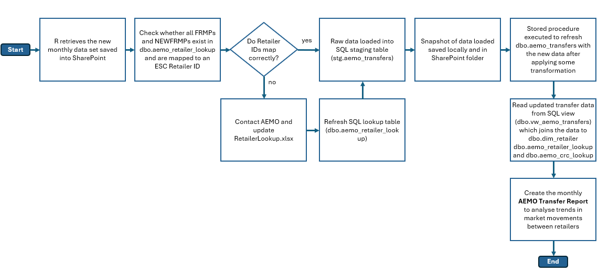

# AEMO MSATS Transfers reporting pipeline.

## Overview

Purpose: Collect monthly AEMO (Australian Energy Market Operator) retail transfer CSVs from SharePoint, validate and load them into an Azure SQL staging table (`stg.aemo_transfers`), run verification checks and generate monthly outputs and charts.

---

## Visualising the Pipeline



### Key Metrics Tracked

- **M57A** - Transfer statistics (customer switches between retailers)
- **M71** - Active NMI (National Meter Identifier) counts per retailer

## Prerequisites

### Software Requirements
- **R**
- **RStudio**
- **ODBC Driver** for SQL Server (version 17 or 18)

### R Packages
**Core data processing:** `DBI`, `odbc`, `dplyr`, `lubridate`, `readr`, `janitor`, `tidyr`  
**SharePoint integration:** `Microsoft365R`  
**Utilities:** `cli`, `fs`, `here`, `stringr`, `glue`, `purrr`  
**Reporting:** `rmarkdown`, `plotly`, `crosstalk`, `kableExtra`, `htmltools`  
**Excel handling:** `readxl`, `writexl`, `openxlsx`

### Access Requirements
- **Azure SQL Database** read/write permissions to:
  - `stg.aemo_transfers` (staging table for incoming data)
  - `dbo.aemo_transfers_data` (production table with enriched records)
  - `dbo.vw_aemo_transfers` (analytical view with all lookups applied)
  - `dbo.aemo_retailer_lookup` (AEMO IDs to ESC retailer ID mapping)
  - `dbo.aemo_crc_lookup` (Change Request Code definitions)
  - `dbo.usp_upsert_aemo_transfers_data` (stored procedure for incremental refresh)
  
- **SharePoint** access to:
  - AEMO monthly transfer data folder (source CSVs)
  - Import snapshots folder (audit trail)
  - Lookup files: `RetailersLookup.xlsx`, `CRC_lookup.xlsx`

## Project Structure

### Historical Data Load (00_mass_upload_scripts/)
**Purpose:** One-time bulk import of historical data (2018-2025)

| Script Name | Description |
|------------|-------------|
| `00_get_data.R` | Download all monthly transfer CSVs from SharePoint into local data folder |
| `01_load_and_write_to_sql.R` | Load all historical AEMO transfer CSVs into the SQL staging table stg.aemo_transfers using a chunk-streamed ingestion pipeline. **Run once during initial setup** |
| `02_verification.R` | Verify that every CSV in the checkpoint has been successfully loaded into SQL with correct row counts and non-null date fields |

---

### Monthly Update Pipeline (01_monthly_scripts/)
**Purpose:** Routine monthly data ingestion and reporting

| Script Name | Description |
|------------|-------------|
| `00_run_all.R` | **Primary entry point**<br>Executes all scripts below |
| `00_run_completion.R` | **Completion pipeline**<br>Loads validated data to SQL, prepares reporting data, and generates HTML report. Run manually after fixing validation failures |
| `01_config.R` | **Configuration and environment setup**<br>Loads all required R packages, sets up global folder pathways, defines sql and sharepoint connection parameters and writes resuablel helper functions |
| `02_get_new_month_data.R` | **SharePoint data retrieval**<br>Downloads newest monthly transfer data CSV from SharePoint |
| `03_check_retailer_ids.R` | **Validation checkpoint**<br>Validate FRMP and NEWFRMP IDs in the latest monthly AEMO CSV |
| `04_load_data_sql.R` | **Data loading and transformation**<br> - After successful ID validation, loads the newest monthly transfer CSV into SQL staging table<br>
- Saves snapshot of raw data loaded locally (02_data/snapshots) and on SharePoint ("5 - Data Repository/AEMO Transfers/Imported")<br>
- Runs an incremental stored procedure to refresh dbo.aemo_transfers_data |
| `05_read_updated_transfer_data.R` | **Report data preparation**<br>Read updated transfer data from SQL view (dbo.vw_aemo_transfers) into R |
| `transfers_report.html` | **Report creation**<br> Generates the monthly AEMO Transfer report as `transfers_report.html`

---

### Lookup Updates (03_lookup_changes/)
**Purpose:** Maintain reference data for retailer identification

| Script Name | Description |
|------------|-------------|
| `update_retailers_lookup.R` | Refresh an AEMO → ESC retailer lookup table (dbo.aemo_retailer_lookup) in SQL Server<br> **Run when AEMO provides updated retailer mappings** |
| `update_crc_lookup.R` | Refresh an Change Request Code lookup table (dbo.aemo_crc_lookup) in SQL Server |

---

### Checkpoints & snapshots (05_checkpoints/ and 02_data/snapshots/)
**Purpose:** Maintain a record of what has been loaded to SQL

- **Mass load checkpoints**: `05_checkpoints/transfers_completed_files.csv` tracks which files have been loaded via the mass-load pipeline.
- **Monthly snapshots**: Saved to `02_data/snapshots/` when `03_load_data_sql.R` runs (both local CSV and upload to SharePoint).
- Checkpoints are read before processing to skip already-loaded files and avoid duplicates.

---

## Steps to Execute the Pipeline

### Save and extract the new monthly csv

1. Open the email received from AEMO and save a copy of the zip folder on your PC

2. Extract the contents of the zip folder using ‘7-zip File Manager’. To extract, use the password VIC_stat_19106350.

3. Save the csv file into this [Sharepoint folder](https://escvic.sharepoint.com/:f:/r/teams/IntelligenceandAnalysisESC/Shared Documents/3 - Services/AEMO MSATS Transfers data/Data?csf=1&web=1&e=vN9KrP)

### Setting up this repo:


**4. Clone Repository**
   - Open RStudio
   - Select File → New Project → Version Control → Git
   - Paste repository URL:
```bash
     https://github.com/arzu-esc/aemo-retail-transfers.git
```
   > ⚠️ **Important:** Ensure project directory is **NOT** in OneDrive or SharePoint (prevents file locking issues)

**5. Configure Project**
   - Install required packages:
   ```r
    install.packages(c("dplyr", "ggplot2", "janitor", "readxl", "scales"))
   ``` 
   - Open `01_monthly_scripts/01_config.R`
   - Update database connection:
```r
     UID <- "your.email@esc.vic.gov.au"  # Replace with your ESC email
```
   - Verify SharePoint paths match your site structure:
```r
     sharepoint_url <- "https://escvic.sharepoint.com/teams/..."
     sharepoint_data_folder <- "3 - Services/AEMO MSATS Transfers Data/Data"
     sharepoint_import_folder <- "5 - Data Repository/AEMO Transfers/Imported"
```

**6. Prepare for Monthly Update**
  - Ensure new monthly CSV has been published to SharePoint by AEMO
  - Check that previous month's update completed successfully
  - Verify you have database write permissions

**7. Run Primary Pipeline**

```r
setwd("01_monthly_scripts")
source("00_run_all.R")
```

This executes in sequence:
1. **Configuration** (`01_config.R`)
2. **Data Download** (`02_get_new_month_data.R`)
3. **Retailer ID Validation** (`03_check_retailer_ids.R`)

**Two possible outcomes:**

**8.1 All retailer IDs map correctly** and the rest of the scripts execute automatically:
  - `04_load_data_sql.R`
  - `05_read_updated_transfer_data.R`
  - `transfers_report.Rmd` --> Generates `transfers_report.html`

**8.2 AEMO retailer IDs missing from retailer look up**

  **Steps to take:**
  
    1. Review the missing_ids in `04_outputs/missing_ids`
    
    ```r
    missing_ids <- read.csv("04_outputs/missing_ids/missing_ids_summary.csv")
    View(missing_ids)
    ```
    
    This shows:
      - Which stat type has unmapped IDs (M71 or M57A)
      - Which field is affected (FRMP or NEWFRMP)
      - The actual unmapped ID values
      
    2. Contact AEMO and ask for:
      - Updated participant ID list
      - Updated participant and company ID mapping.
      
    3. Update **RetailersLookup.xlsx** with the new mapping.
      - Navigate to SharePoint AEMO folder
      - Open `RetailersLookup.xlsx`
      - Add new rows for unmapped IDs
      - Ensure all columns are complete:
        - `PARTICIPANTID` - AEMO participant identifier
        - `CORPORATIONID` - AEMO corporation identifier  
        - `ESC RetailerCommonID` - ESC internal retailer ID
      - Save and close file
    
    4. Run script to Refresh SQL Lookup Table:
    
      ```r 
      source("03_lookup_changes/update_retailers_lookup.R")
      ```
    5. Run retailer id validation script again to make sure mapping is working: 
    
      ```r 
      source("01_monthly_scripts/04_check_retailer_ids.R")
      ```
    6. Run 00_run_completion.R to complete the pipeline if validation passes:
    
      ```r 
      source("00_run_completion.R")
      ```
---

### 9. Manually Regenerate Report (Optional)

If you need to regenerate just the report (without re-loading data):

```r
# First ensure data is current
source("01_monthly_scripts/05_read_updated_transfer_data.R")

# Then render report
rmarkdown::render("transfers_report.Rmd")
```

---

### 10. Verify Completion

**Checklist:**
- [ ] Console shows: `"Transfer report created"`
- [ ] File exists: `02_data/transfers_raw.rds`
- [ ] File exists: `transfers_report.html`
- [ ] Report opens correctly in browser
- [ ] Charts are interactive (hover tooltips work)
- [ ] Drill-down buttons function properly
- [ ] Data matches expected date range
- [ ] Latest month appears in visualisations
- [ ] Snapshot uploaded to SharePoint: `5 - Data Repository/AEMO Transfers/Imported/`
- [ ] Checkpoint updated with new file

---

**Troubleshooting**
- If a SharePoint connection fails, confirm `SHAREPOINT_SITE_URL` and `SHAREPOINT_DATA_FOLDER` values and that `Microsoft365R` can access your SharePoint via AAD.
- If SQL connection fails, confirm `SQL_SERVER`, `SQL_DATABASE`, and your account permissions. Try connecting with `odbc::odbc()` interactively first.
- If a script stops because a file is already in the checkpoint, check `transfers_completed_files.csv` to verify if the file was already loaded.

**Contact / Author**
- For questions about the pipeline, contact Arzu Khanna (author of the scripts).

---
This README is a summary to help run and maintain the Transfers-Reporting pipeline. For details, inspect the scripts referenced above.
